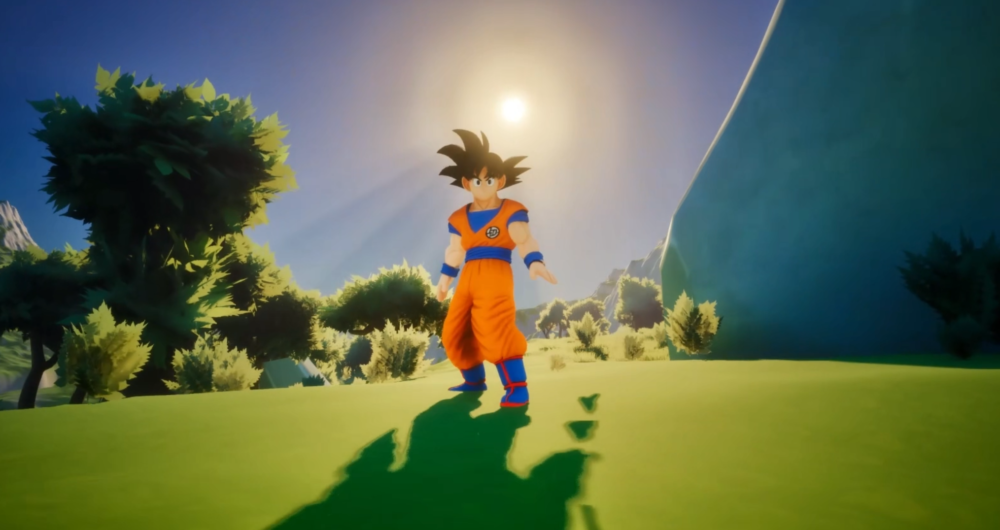
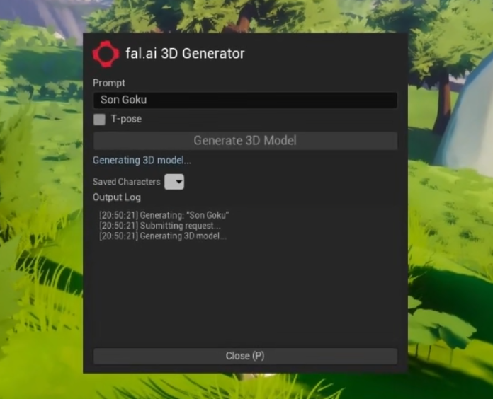

# Prompt-to-Player for Unreal Engine - Powered by fal.ai

Generate 3D characters from text prompts inside Unreal Engine 5, auto-rig and animate them, then **play as them**, all during runtime. Type "Son Goku" and within minutes you're running, jumping, sprinting, and fighting as a fully animated Goku in a third-person game.

Built entirely in C++ with a programmatic UMG widget  - no Blueprint widgets needed.

<!-- Hero image: replace with a screenshot or GIF of gameplay -->


## Features

- **Text-to-3D generation** via [fal.ai Hunyuan 3D](https://fal.ai/models/fal-ai/hunyuan-3d/v3.1/pro/text-to-3d)  - generates a 3D mesh from any text prompt
- **Auto-rigging and animation** via [Meshy API](https://docs.meshy.ai/api-rig-and-animate-3d-models)  - automatically rigs the generated mesh with a humanoid skeleton and generates walk, run, sprint, jump, and kick animations
- **Real-time character swap**  - replaces the player character mesh with the generated model, complete with movement-driven animation
- **Character history**  - saves your last 5 generated characters in a dropdown for instant loading across play sessions
- **Sprint and combat**  - hold Shift to sprint, press F for a flying kick
- **T-pose option**  - checkbox to generate characters in T-pose for cleaner rigging (recommended when arms are close to the torso, which can cause limb-blending artifacts during animation)
- **Native Unreal editor styling**  - the in-game panel uses `FAppStyle` brushes, fonts, and button styles to look like a built-in Unreal editor panel
- **Fully programmatic UI**  - the entire widget is constructed in C++ using `WidgetTree->ConstructWidget<>()`, no UMG designer or Blueprint assets

> **Note:** fal.ai is currently integrating the Meshy rigging and animation API directly into the fal platform. Once complete, the entire pipeline (generation + rigging + animation) will be unified under a single fal.ai API call. This project will be updated to use the unified API when available.

<!-- Widget screenshot: replace with a screenshot of the generator panel -->


## How It Works

1. Press **P** to open the generator panel
2. Type a text prompt (e.g. "Son Goku")
3. Optionally check **T-pose** (helps with characters whose arms are close to their body)
4. Click **Generate 3D Model**
5. Wait while the pipeline runs (~2-4 minutes):
   - fal.ai generates the 3D mesh
   - A static preview spawns in front of your character
   - Meshy rigs the mesh and generates 6 animations (idle, walk, run, sprint, jump, kick)
   - All animation GLBs are downloaded in parallel
6. Your character is automatically swapped  - you are now the generated character
7. Press **P** to close the panel and play

### Controls

| Key | Action |
|-----|--------|
| **P** | Toggle generator panel |
| **WASD** | Move |
| **Space** | Jump |
| **Left Shift** (hold) | Sprint |
| **F** | Flying fist kick |
| **Mouse** | Look around |

### Saved Characters

The dropdown in the generator panel shows your last 5 generated characters. Click the chevron to see the list, then select a character to load it instantly  - no need to regenerate. Character URLs are cached in `Saved/CharacterHistory.json` and persist across play sessions.

## Architecture

| Class | Role |
|-------|------|
| `UFalApiClient` | HTTP client for fal.ai queue API (submit, poll, fetch result) |
| `UMeshyRigClient` | HTTP client for Meshy rigging + animation API (rig, animate, poll) |
| `UFalGeneratorWidget` | Programmatic UMG panel with editor styling, log viewer, character history |
| `Afal3DDemoCharacter` | Owns all clients + widget, handles character swap, movement animation, sprint, combat |

The generated GLB is loaded at runtime using the [glTFRuntime](https://github.com/rdeioris/glTFRuntime) plugin.

### Animation Pipeline

1. **Generation**: fal.ai Hunyuan 3D creates a textured GLB mesh from the prompt
2. **Rigging**: Meshy API rigs the mesh with a humanoid skeleton (Hips, Spine, Arms, Legs, etc.)
3. **Animation**: Meshy generates animation GLBs for each movement type using `action_id`:
   - `0`  - Idle
   - `30`  - Casual Walk
   - `14`  - Run
   - `16`  - Fast Run (Sprint)
   - `466`  - Regular Jump
   - `94`  - Flying Fist Kick
4. **Extraction**: glTFRuntime loads each GLB, extracts the skeletal mesh and `UAnimSequence` assets at runtime
5. **Playback**: The character's `UpdateMovementAnimation()` checks velocity and input state each tick, switching animations based on movement

### Known Quirks

- **Animation scale differences**: Different Meshy animation GLBs bake slightly different scales into their keyframe data. The code applies hardcoded scale corrections per animation (configurable in `ExtractAndSwapCharacter()`).
- **Animation snapping**: Switching between animations is a hard cut (no crossfade blending). This is a limitation of `USkeletalMeshComponent::PlayAnimation()` in single-node mode. Proper blending would require a custom `UAnimInstance` subclass.
- **T-pose recommendation**: Characters with arms close to their torso (e.g. characters in a natural standing pose) can have limb-blending artifacts during animation, where arms and torso mesh vertices blend together. Generating in T-pose keeps the arms separated, which gives the rigging algorithm cleaner geometry to work with.

## Prerequisites

- **Unreal Engine 5.5**
- A **fal.ai API key**  - get one at [fal.ai/dashboard/keys](https://fal.ai/dashboard/keys)
- A **Meshy API key**  - get one at [meshy.ai/api](https://www.meshy.ai/api)

## Setup

### 1. Clone the repo

```bash
git clone --recursive https://github.com/blendi-remade/fal-3d-unreal.git
```

> The `--recursive` flag is required to pull the glTFRuntime plugin submodule.

### 2. Add stock Epic content

The repo excludes large stock assets (StarterContent, Characters) to keep the repo size manageable. You need to copy them from a fresh UE5 Third Person template:

1. In UE5, create a new **Third Person** project (call it anything)
2. Copy these folders from the new project's `Content/` into `fal3DDemo/Content/`:
   - `Characters/`
   - `StarterContent/`

### 3. Set your API keys

Create a `.env` file in the `fal3DDemo/` folder:

```
FAL_KEY=your-fal-api-key-here
MESHY_KEY=your-meshy-api-key-here
```

See `.env.example` for reference. The code also supports setting `FAL_KEY` and `MESHY_KEY` as OS environment variables as a fallback.

**Where to get the keys:**
- **fal.ai**: Sign up at [fal.ai](https://fal.ai), then go to [Dashboard > Keys](https://fal.ai/dashboard/keys)
- **Meshy**: Sign up at [meshy.ai](https://www.meshy.ai), then go to [API Settings](https://www.meshy.ai/api) to generate a key

### 4. Open the project

Double-click `fal3DDemo/fal3DDemo.uproject` to open in Unreal Editor. It will compile the C++ code automatically.

### 5. Play

Click **Play** (or press Alt+P), then press **P** to open the generator panel.

## Project Structure

```
fal3DDemo/
  Source/fal3DDemo/
    FalApiClient.h/.cpp        # fal.ai HTTP submit/poll/result pipeline
    MeshyRigClient.h/.cpp      # Meshy rigging + animation API client
    FalGeneratorWidget.h/.cpp   # Programmatic UMG panel with editor styling
    fal3DDemoCharacter.h/.cpp   # Character: panel, swap, animations, sprint, combat
    fal3DDemo.Build.cs          # Module dependencies
  Content/
    ThirdPerson/
      Input/Actions/IA_TogglePanel.uasset  # P key input action
      Input/IMC_Default.uasset             # Input mapping context
      Blueprints/BP_ThirdPersonCharacter.uasset
    UI/fal_logo.png             # fal.ai logo for the spinner
  Plugins/glTFRuntime/          # glTF/GLB runtime loader (submodule)
  Saved/CharacterHistory.json   # Cached character URLs (auto-generated)
  .env                          # Your API keys (gitignored)
  .env.example                  # Template for .env
```

## Troubleshooting

- **"MESHY_KEY not found"**  - Make sure your `.env` file is in the `fal3DDemo/` directory (same level as `fal3DDemo.uproject`) and contains `MESHY_KEY=your-key`
- **Character appears tiny or huge**  - The auto-scaling targets 180cm. If it looks wrong, check the logs for `computed scale` values. The scale correction constants in `ExtractAndSwapCharacter()` can be tuned.
- **Animations look jerky when switching**  - This is the hard-cut animation switching (no blend). It's a known limitation.
- **Arms blending into torso during animations**  - Try regenerating with the T-pose checkbox enabled
- **Widget not appearing**  - Make sure the `IA_TogglePanel` input action is bound to the **P** key in `IMC_Default` in the editor. Check the Output Log for `LogFalWidget` messages.
- **Live Coding fails**  - If you changed `.h` files, you must close the editor and do a full rebuild. Live Coding (Ctrl+Alt+F11) only works for `.cpp`-only changes.

## License

MIT
