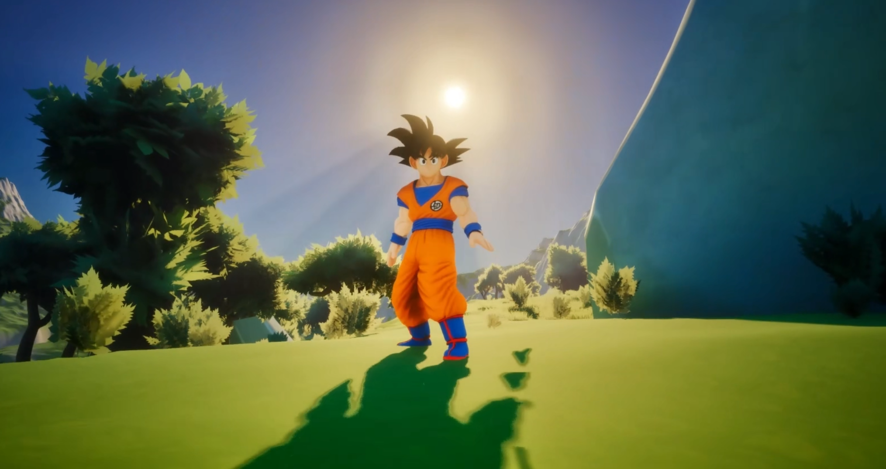
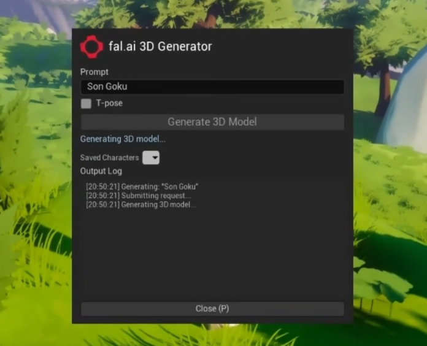

# Prompt-to-Player for Unreal Engine - Powered by fal.ai

Generate 3D characters from text prompts or images inside Unreal Engine 5, auto-rig and animate them, then **play as them**, all during runtime. Type a character description or browse a photo of someone and within minutes you're running, jumping, sprinting, and fighting as a fully animated character in a third-person game.

The whole pipeline runs on [fal.ai](https://fal.ai) with a single API key: nano-banana-2 for a pose-controlled concept image, Meshy-7 for the mesh, and Meshy rigging + animation through fal for the character rig.

Built entirely in C++ with a programmatic UMG widget  - no Blueprint widgets needed.

<!-- Hero image: replace with a screenshot or GIF of gameplay -->


## Features

- **Text-to-3D generation**  - the prompt is first rendered by [nano-banana-2](https://fal.ai/models/fal-ai/nano-banana-2) into a clean, front-facing concept image in an explicit A-pose or T-pose on white, then [Meshy-7 image-to-3D](https://fal.ai/models/meshy/v7/image-to-3d) turns that into a fully textured mesh (ultra mode, 100k target polycount). Image conditioning gives a much more reliable rig-friendly pose than text-to-3D alone, and you see the concept in the panel before the 3D step starts
- **Image-to-3D generation** via [Meshy-7 on fal.ai](https://fal.ai/models/meshy/v7/image-to-3d)  - browse a photo and generate a 3D character from it. Meshy's native `pose_mode` puts the subject into a rig-friendly A-pose or T-pose, so no separate image preprocessing step is needed
- **Auto-rigging and animation** via [fal-ai/meshy/rigging/multi-animation](https://fal.ai/models/fal-ai/meshy/rigging/multi-animation)  - one request rigs the mesh with a humanoid skeleton and generates all 8 animation clips (idle, walk, run, sprint, jump, boxing, kick, punch)
- **Real-time character swap**  - replaces the player character mesh with the generated model, complete with movement-driven animation
- **Character history**  - saves your last 5 generated characters in a dropdown for instant loading across play sessions
- **Sprint and combat**  - hold Shift to sprint, press F for a flying kick, V for boxing, left mouse for a punch
- **Pose control**  - characters are generated in A-pose by default; check **T-pose** for characters whose arms sit close to the torso (avoids limb-blending artifacts during animation). Works for both text and image input
- **Native Unreal editor styling**  - the in-game panel uses `FAppStyle` brushes, fonts, and button styles to look like a built-in Unreal editor panel
- **Fully programmatic UI**  - the entire widget is constructed in C++ using `WidgetTree->ConstructWidget<>()`, no UMG designer or Blueprint assets

<!-- Widget screenshot: replace with a screenshot of the generator panel -->


## How It Works

### Text-to-3D

1. Press **P** to open the generator panel
2. Type a text prompt (e.g. "a stocky dwarven blacksmith with a braided beard")
3. Optionally check **T-pose** (helps with characters whose arms are close to their body)
4. Click **Generate 3D Model**
5. Wait while the pipeline runs (several minutes; the panel shows live progress):
   - nano-banana-2 renders a front-facing concept image in the requested pose. It appears in the panel as soon as it's ready
   - Meshy-7 image-to-3D generates and textures the mesh from that image
   - A static preview spawns in front of your character
   - fal's multi-animation endpoint rigs the mesh and generates 8 animation clips (idle, walk, run, sprint, jump, boxing, kick, punch)
   - All GLBs are downloaded in parallel
6. Your character is automatically swapped  - you are now the generated character
7. Press **P** to close the panel and play

### Image-to-3D

1. Press **P** to open the generator panel
2. Click **Browse Image** and select a photo from your computer (PNG or JPG)
3. A preview of the image appears in the panel. The text prompt is disabled; the T-pose checkbox still applies
4. Click **Generate from Image**
5. The image is sent as a base64 data URI to Meshy-7 image-to-3D with `pose_mode` set to A-pose (or T-pose). From there the flow is the same as text-to-3D: rig and animate, download in parallel, and you become the character
6. Click the **X** button next to the filename to clear the image and switch back to text-to-3D mode

### Controls

| Key | Action |
|-----|--------|
| **P** | Toggle generator panel |
| **WASD** | Move |
| **Space** | Jump |
| **Left Shift** (hold) | Sprint |
| **F** | Flying fist kick |
| **V** | Boxing combo |
| **Left mouse** | Kung fu punch |
| **Mouse** | Look around |

### Saved Characters

The dropdown in the generator panel shows your last 5 generated characters. Click the chevron to see the list, then select a character to load it instantly  - no need to regenerate. Character URLs are cached in `Saved/CharacterHistory.json` and persist across play sessions.

## Architecture

| Class | Role |
|-------|------|
| `UFalQueueRequest` | One submit / poll / fetch cycle against the fal.ai queue API. Loads `FAL_KEY`, surfaces fal's real error messages, shows Meshy's live progress logs |
| `UFalApiClient` | Text path: nano-banana-2 concept image then Meshy-7 image-to-3D. Image path: Meshy-7 image-to-3D directly |
| `UFalRigClient` | Single `meshy/rigging/multi-animation` request that rigs the GLB and returns all animation clips |
| `UFalGeneratorWidget` | Programmatic UMG panel with editor styling, log viewer, character history |
| `Afal3DDemoCharacter` | Owns all clients + widget, handles character swap, movement animation, sprint, combat |

The generated GLB is loaded at runtime using the [glTFRuntime](https://github.com/rdeioris/glTFRuntime) plugin.

### Animation Pipeline

1. **Generation**: for text, nano-banana-2 produces a pose-controlled concept image; that image (or your own photo) goes to Meshy-7 image-to-3D, which creates a textured GLB mesh in A-pose or T-pose
2. **Rigging + Animation**: one call to `fal-ai/meshy/rigging/multi-animation` rigs the mesh with a humanoid skeleton and generates a GLB per Meshy animation-library `action_id`:
   - `0`  - Idle
   - `30`  - Casual Walk
   - `14`  - Run
   - `16`  - Fast Run (Sprint)
   - `466`  - Regular Jump
   - `87`  - Boxing Practice
   - `94`  - Flying Fist Kick
   - `96`  - Kung Fu Punch
3. **Extraction**: glTFRuntime loads each GLB, extracts the skeletal mesh and `UAnimSequence` assets at runtime
4. **Playback**: The character's `UpdateMovementAnimation()` checks velocity and input state each tick, switching animations based on movement

### Known Quirks

- **Animation scale differences**: Different Meshy animation GLBs bake slightly different scales into their keyframe data. The code applies hardcoded scale corrections per animation (configurable in `ExtractAndSwapCharacter()`).
- **Animation snapping**: Switching between animations is a hard cut (no crossfade blending). This is a limitation of `USkeletalMeshComponent::PlayAnimation()` in single-node mode. Proper blending would require a custom `UAnimInstance` subclass.
- **T-pose recommendation**: Characters with arms close to their torso (e.g. characters in a natural standing pose) can have limb-blending artifacts during animation, where arms and torso mesh vertices blend together. Generating in T-pose keeps the arms separated, which gives the rigging algorithm cleaner geometry to work with.

## Prerequisites

- **Unreal Engine 5.5**
- A **fal.ai API key**  - get one at [fal.ai/dashboard/keys](https://fal.ai/dashboard/keys). This is the only key you need; Meshy runs through fal

## Setup

### 1. Clone the repo

```bash
git clone --recursive https://github.com/blendi-remade/fal-3d-unreal.git
```

> The `--recursive` flag is required to pull the glTFRuntime plugin submodule.

### 2. Add stock Epic content

The repo excludes large stock assets (StarterContent, Characters) to keep the repo size manageable. You need to copy them from a fresh UE5 Third Person template:

1. In UE5, create a new **Third Person** project (call it anything)
2. Copy these folders from the new project's `Content/` into `fal3DDemo/Content/`:
   - `Characters/`
   - `StarterContent/`

### 3. Set your API key

Create a `.env` file in the `fal3DDemo/` folder:

```
FAL_KEY=your-fal-api-key-here
```

See `.env.example` for reference. The code also falls back to a `FAL_KEY` OS environment variable.

Sign up at [fal.ai](https://fal.ai), then create a key under [Dashboard > Keys](https://fal.ai/dashboard/keys).

### 4. Open the project

Double-click `fal3DDemo/fal3DDemo.uproject` to open in Unreal Editor. It will compile the C++ code automatically.

### 5. Play

Click **Play** (or press Alt+P), then press **P** to open the generator panel.

## Project Structure

```
fal3DDemo/
  Source/fal3DDemo/
    FalQueueRequest.h/.cpp     # Shared fal.ai queue client (submit/poll/fetch, API key, errors)
    FalApiClient.h/.cpp        # nano-banana-2 concept image + Meshy-7 image-to-3D
    FalRigClient.h/.cpp        # Meshy rigging + multi-animation via fal.ai
    FalGeneratorWidget.h/.cpp   # Programmatic UMG panel with editor styling
    fal3DDemoCharacter.h/.cpp   # Character: panel, swap, animations, sprint, combat
    fal3DDemo.Build.cs          # Module dependencies
  Content/
    ThirdPerson/
      Input/Actions/IA_TogglePanel.uasset  # P key input action
      Input/IMC_Default.uasset             # Input mapping context
      Blueprints/BP_ThirdPersonCharacter.uasset
    UI/fal_logo.png             # fal.ai logo for the spinner
  Plugins/glTFRuntime/          # glTF/GLB runtime loader (submodule)
  Saved/CharacterHistory.json   # Cached character URLs (auto-generated)
  .env                          # Your fal.ai API key (gitignored)
  .env.example                  # Template for .env
```

## Troubleshooting

- **"FAL_KEY not found"**  - Make sure your `.env` file is in the `fal3DDemo/` directory (same level as `fal3DDemo.uproject`) and contains `FAL_KEY=your-key`
- **"Generation failed: ... content checker"**  - fal's safety checker rejected the prompt or image. Trademarked character names are a common trigger; describe the character instead of naming it
- **Character appears tiny or huge**  - The auto-scaling targets 180cm. If it looks wrong, check the logs for `computed scale` values. The scale correction constants in `ExtractAndSwapCharacter()` can be tuned.
- **Animations look jerky when switching**  - This is the hard-cut animation switching (no blend). It's a known limitation.
- **Arms blending into torso during animations**  - Try regenerating with the T-pose checkbox enabled
- **Sword / staff / cape bends like rubber**  - The auto-rig skins props and loose cloth to nearby limb bones. Prompt for characters with no held props, tight clothing and a fused silhouette (armor, helmets, backpacks are fine)
- **Widget not appearing**  - Make sure the `IA_TogglePanel` input action is bound to the **P** key in `IMC_Default` in the editor. Check the Output Log for `LogFalWidget` messages.
- **Live Coding fails**  - If you changed `.h` files, you must close the editor and do a full rebuild. Live Coding (Ctrl+Alt+F11) only works for `.cpp`-only changes.

## License

MIT
